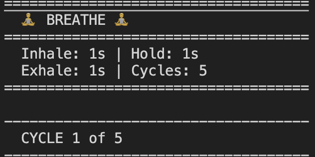

# Breathe

A simple terminal-based breathing timer written in Tomo.



## Description

Breathe is a guided breathing timer that helps you practice controlled breathing exercises. It features:

- Customizable inhale, hold, and exhale durations
- Visual indicators for each breathing phase

## Usage

Run the application with:

```
tomo breathe.tm
```

To customize parameters:

```
tomo breathe.tm -- --inhale-time VALUE --hold-time VALUE --exhale-time VALUE --cycles VALUE
```

Where:
- `--inhale-time`: Duration in seconds for the inhale phase (default: 4)
- `--hold-time`: Duration in seconds for the hold phase (default: 4)
- `--exhale-time`: Duration in seconds for the exhale phase (default: 4)
- `--cycles`: Number of breathing cycles to perform (default: 4)

### Example

```
tomo breathe.tm -- --inhale-time=2 --hold-time=3 --exhale-time=2 --cycles=3
```

This will start a breathing timer with:
- 2 seconds inhale (↑)
- 3 seconds hold (→)
- 2 seconds exhale (↓)
- 3 seconds hold (→)
- 3 complete cycles

## Installation

1. Clone this repository:
```
git clone https://github.com/andrewlidong/breathe.git
cd breathe
```

1. Make sure you have Tomo installed. You can find it at [github.com/bruce-hill/tomo](https://github.com/bruce-hill/tomo).

2. Run the program:
```
tomo breathe.tm
```

## Notes

- The breathing pattern used is sometimes called "box breathing" or "square breathing"
- Command line arguments are parsed automatically based on the main() function parameters
- **Note:** The `--` separator is required when passing arguments to your script

## Credits

Created with Tomo - tomorrow's language. 